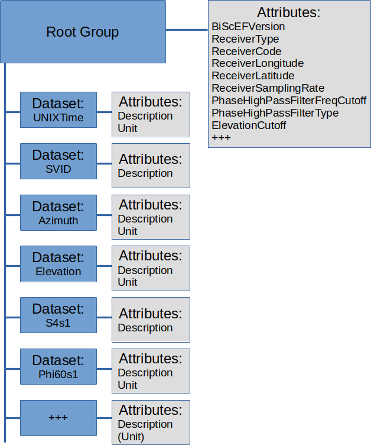

# Binary Scintillation Exchange Format (BiScEF) - Version #.#

The format is intended to be used for archiving and exchange of
scintillation data. It is intended to be flexible and extensible.
Although it defines many parameteres and datasets, only a minimum set of
information is mandatory. This allows the file contents to be adjusted
for different setups, while guaranteeing the minimum amount of
information required to understand and use the data.

## File format: NetCDF4 / HDF5

(File is both a valid NetCDF4 file and a valid HDF5 file)

See e.g.:
<https://docs.unidata.ucar.edu/netcdf-c/current/interoperability_hdf5.html>

> \"*Assuming a HDF5 file is written in accordance with the netCDF-4
> rules (i.e. no strange types, no looping groups), and assuming that
> every dataset has a dimension scale attached to each dimension, the
> netCDF-4 API can be used to read and edit the file, quite easily.*\"

> <https://docs.unidata.ucar.edu/nug/current/netcdf_data_set_components.html>

## File naming convention:

It is recommended to use one of these naming schemes:

\[CountryCode\]\[ReceiverCode\]\[yyyy\]\[mm\]\[dd\].nc (daily files)

\[CountryCode\]\[ReceiverCode\]\[yyyy\]\[mm\]\[dd\]\_\[hh\].nc (hourly
files)

\[CountryCode\]\[ReceiverCode\]\[yyyy\]\[mm\]\[dd\]\_n\[serialnumber\].nc
(alternative numbering scheme)

\[CountryCode\]\[ReceiverCode\]\_n\[serialnumber\].nc (alternative
numbering scheme)

\[ReceiverCode\] = 4-character identifier

\[CountryCode\] = ISO 3166-1 alpha-3 (e.g. \"NOR\")

\[yyyy\] = year, 4 digits

\[mm\] = month, 2 digits

\[dd\] = day, 2 digits

\[hh\] = hour, 2 digits

\[serialnumber\] = An integer. To be used if a different numbering
scheme is wanted, e.g. numbering events.

## File contents:

Each file contains data from 1 receiver.

The time period contained within is recommended to be 1 day or less, but
the format allows for more.

## Metadata:

Attributes at root level in the file:

|--------------------|------------|--------------------|------------|
| Name               | Type       | Description        | Mandatory? |
|--------------------|------------|--------------------|------------|
| BiScEFVersion      | String     | The version of the | Yes        |
|                    |            | format used in     |            |
|                    |            | this file.         |            |
|                    |            |                    |            |
|                    |            | Consists of a      |            |
|                    |            | string of the form |            |
|                    |            | \"1.0\", where the |            |
|                    |            | first number is    |            |
|                    |            | the major version  |            |
|                    |            | and the second     |            |
|                    |            | number is the      |            |
|                    |            | minor version.     |            |
|                    |            |                    |            |
|                    |            | Files of the same  |            |
|                    |            | major version are  |            |
|                    |            | backwards          |            |
|                    |            | compatible.        |            |
|--------------------|------------|--------------------|------------|
|                    |            |                    |            |
|--------------------|------------|--------------------|------------|
| Hardware           |            |                    |            |
| information        |            |                    |            |
|--------------------|------------|--------------------|------------|
| ReceiverType       | String     | Model name of      | Yes        |
|                    |            | receiver           |            |
|--------------------|------------|--------------------|------------|
| ReceiverFWVersion  | String     | Receiver firmware  | No         |
|                    |            | version            |            |
|--------------------|------------|--------------------|------------|
| ReceiverCode       | String     | Receiver           | Yes        |
|                    |            | identifier         |            |
|                    |            | (typically, a      |            |
|                    |            | 4-letter code)     |            |
|--------------------|------------|--------------------|------------|
| ReceiverIdNum      | integer    | Receiver id number | No         |
|                    |            |                    |            |
|                    |            | (Not               |            |
|                    |            | internati          |            |
|                    |            | onally/interagency |            |
|                    |            | coordinated.       |            |
|                    |            | Numbering should   |            |
|                    |            | be valid within    |            |
|                    |            | the Agency that    |            |
|                    |            | collected the      |            |
|                    |            | data)              |            |
|--------------------|------------|--------------------|------------|
| ReceiverLongitude  | float      | Approximate        | Yes        |
|                    |            | geographical       |            |
|                    |            | Longitude, in      |            |
|                    |            | degrees East, of   |            |
|                    |            | the receiver.      |            |
|--------------------|------------|--------------------|------------|
| ReceiverLatitude   | float      | Approximate        | Yes        |
|                    |            | geographical       |            |
|                    |            | Latitude, in       |            |
|                    |            | degrees North, of  |            |
|                    |            | the receiver.      |            |
|--------------------|------------|--------------------|------------|
| ReceiverHeight     | float      | Approximate        | No         |
|                    |            | geographical       |            |
|                    |            | Height, in meters, |            |
|                    |            | of the receiver.   |            |
|                    |            |                    |            |
|                    |            | Height is the      |            |
|                    |            | height above the   |            |
|                    |            | WGS-84 ellipsoid.  |            |
|--------------------|------------|--------------------|------------|
| ReceiverCoord      | float\[3\] | Approximate        | No         |
|                    |            | geocentric         |            |
|                    |            | coordinate (x, y,  |            |
|                    |            | z) of the          |            |
|                    |            | receiver, in       |            |
|                    |            | meters.            |            |
|--------------------|------------|--------------------|------------|
| Re                 | float      | Sampling rate of   | Yes        |
| ceiverSamplingRate |            | the receiver, in   |            |
|                    |            | Hz.                |            |
|--------------------|------------|--------------------|------------|
| AntennaType        | String     | Model name of      | No         |
|                    |            | antenna.           |            |
|                    |            |                    |            |
|                    |            | Not mandatory, but |            |
|                    |            | recommended.       |            |
|--------------------|------------|--------------------|------------|
| AntennaSerialNo    | String     | Serial number of   | No         |
|                    |            | antenna            |            |
|--------------------|------------|--------------------|------------|
|                    |            |                    |            |
|--------------------|------------|--------------------|------------|
| File contents      |            |                    |            |
| information        |            |                    |            |
|--------------------|------------|--------------------|------------|
| Constellations     | String\[\] | An array of        | No         |
|                    |            | strings specifying |            |
|                    |            | which              |            |
|                    |            | constellations are |            |
|                    |            | allowed in this    |            |
|                    |            | file. (i.e. other  |            |
|                    |            | constellation are  |            |
|                    |            | excluded)          |            |
|                    |            |                    |            |
|                    |            | \'G\' = GPS        |            |
|                    |            |                    |            |
|                    |            | \'E\' = Galileo    |            |
|                    |            |                    |            |
|                    |            | \'R\' = GLONASS    |            |
|                    |            |                    |            |
|                    |            | \'C\' = BeiDou     |            |
|                    |            |                    |            |
|                    |            | \'S\' = SBAS       |            |
|                    |            |                    |            |
|                    |            | \'J\' = QZSS       |            |
|                    |            |                    |            |
|                    |            | \'I\' = IRNSS      |            |
|--------------------|------------|--------------------|------------|
| SignalStatement    | String     | A textual          | No         |
|                    |            | description        |            |
|                    |            | defining what is   |            |
|                    |            | used as \"signal   |            |
|                    |            | 1\", \"signal 2\"  |            |
|                    |            | and \"signal 3\"   |            |
|                    |            | in this file.      |            |
|                    |            |                    |            |
|                    |            | Not mandatory, but |            |
|                    |            | recommended.       |            |
|                    |            |                    |            |
|                    |            | For example:       |            |
|                    |            |                    |            |
|                    |            | > \"Sig1\" means   |            |
|                    |            | > L1CA for         |            |
|                    |            | > GPS/             |            |
|                    |            | GLONASS/SBAS/QZSS, |            |
|                    |            | > L1BC for         |            |
|                    |            | > GALILEO, B1 for  |            |
|                    |            | > COMPASS.         |            |
|                    |            |                    |            |
|                    |            | > \"Sig2\" means   |            |
|                    |            | > L2C for          |            |
|                    |            | >                  |            |
|                    |            |  GPS/GLONASS/QZSS, |            |
|                    |            | > E5a for GALILEO, |            |
|                    |            | > L5 for SBAS, B2  |            |
|                    |            | > for COMPASS.     |            |
|                    |            |                    |            |
|                    |            | > \"Sig3\" means   |            |
|                    |            | > L5 for GPS/QZSS  |            |
|                    |            | > or E5b for       |            |
|                    |            | > GALILEO.         |            |
|--------------------|------------|--------------------|------------|
|                    |            |                    |            |
|--------------------|------------|--------------------|------------|
| Processing         |            |                    |            |
| information        |            |                    |            |
|--------------------|------------|--------------------|------------|
| PhaseHighPa        | float      | Cutoff frequency   | Yes        |
| ssFilterFreqCutoff |            | of the high-pass   |            |
|                    |            | filter used for    |            |
|                    |            | the phase index    |            |
|                    |            | computation        |            |
|--------------------|------------|--------------------|------------|
| Phase              | String     | Short description  | Yes        |
| HighPassFilterType |            | of the type of     |            |
|                    |            | filter used for    |            |
|                    |            | the high-pass      |            |
|                    |            | filtering of       |            |
|                    |            | phase. (e.g. \"6th |            |
|                    |            | order              |            |
|                    |            | Butterworth\")     |            |
|--------------------|------------|--------------------|------------|
| ElevationCutoff    | float      | Elevation mask     | Yes        |
|                    |            | \[degrees\]. All   |            |
|                    |            | data below this    |            |
|                    |            | elevation has been |            |
|                    |            | excluded from the  |            |
|                    |            | file.              |            |
|--------------------|------------|--------------------|------------|
| SLMHeight          | float      | Height of the      | Sometimes  |
|                    |            | ionospheric Single |            |
|                    |            | Layer, used when   |            |
|                    |            | computing the      |            |
|                    |            | Longitude/Latitude |            |
|                    |            | of the Ionospheric |            |
|                    |            | Pierce Point       |            |
|                    |            | (IPP). In meters.  |            |
|                    |            |                    |            |
|                    |            | Mandatory if the   |            |
|                    |            | datasets           |            |
|                    |            | \"Longitude\" and  |            |
|                    |            | \"Latitude\" are   |            |
|                    |            | provided.          |            |
|--------------------|------------|--------------------|------------|
|                    |            |                    |            |
|--------------------|------------|--------------------|------------|
| Administrative     |            |                    |            |
| information        |            |                    |            |
|--------------------|------------|--------------------|------------|
| Agency             | String     | Agency/            | No         |
|                    |            | Organization/Other |            |
|                    |            | that collected the |            |
|                    |            | data.              |            |
|--------------------|------------|--------------------|------------|
| Country            | String     | Country code for   | No         |
|                    |            | the agency that    |            |
|                    |            | collected the      |            |
|                    |            | data, using the    |            |
|                    |            | standard ISO       |            |
|                    |            | 3166-1 alpha-3     |            |
|--------------------|------------|--------------------|------------|
| Contact            | String     | Contact email      | No         |
|                    |            | address            |            |
|--------------------|------------|--------------------|------------|
|                    |            |                    |            |
|--------------------|------------|--------------------|------------|
| DOI                | String     | Digital Object     | No         |
|                    |            | Identifier (DOI)   |            |
|                    |            | for data citation  |            |
|--------------------|------------|--------------------|------------|
|                    |            |                    |            |
|--------------------|------------|--------------------|------------|
| Comment            | String     | Any additional     | No         |
|                    |            | information that   |            |
|                    |            | does not fit into  |            |
|                    |            | the other fields.  |            |
|--------------------|------------|--------------------|------------|
|                    |            |                    |            |
|--------------------|------------|--------------------|------------|
|                    |            |                    |            |
|--------------------|------------|--------------------|------------|
|                    |            |                    |            |
|--------------------|------------|--------------------|------------|
|                    |            |                    |            |
|--------------------|------------|--------------------|------------|

## Data:

Data are organized as separate datasets containing 1D arrays in time.

All arrays are of the same length, such that all data at the same index
are associated.

The file does not need to contain all types of data.

In fact, none of the scintillation data types are mandatory, but it is
recommended to provide at least the main scintillation index parameters
(\"S4s1\" and \"Phi60s1\").

All datasets in the file share the same dimension \"UNIXTime\". A
dataset/variable named \"UNIXTime\" also exists, containing the values
of that dimension axis. This has been chosen to provide all data on a
common time axis which is not dependent on the GNSS constellation, and
is supported by all computer systems.

There are datasets defined for the commonly used GPS time parameters
(week number and time-of-week), but since these are not used as the
dimension variable they are not mandatory.

  ---------------------------------- ------------- --------------------------------------------------------------------------------- ------------
  Name                               Type          Description                                                                       Mandatory?
  Time parameters                                                                                                                    
  GPSWeek                            integer\[\]   GPS week                                                                          No
  TOW                                integer\[\]   GPS second-of-week                                                                No
  UNIXTime                           integer\[\]   Seconds since Jan 01 1970. (UTC)                                                  Yes

  Satellite parameters                                                                                                               
  SVID                               integer\[\]   Satellite identifier. See separate section for full description.                  Yes
  Azimuth                            float\[\]     Azimuth of satellite \[degrees\]                                                  Yes
  Elevation                          float\[\]     Elevation of satellite \[degrees\]                                                Yes
  Longitude                          float\[\]     Longitude of the Ionospheric Pierce Point (IPP), in degrees East                  No
  Latitude                           float\[\]     Latitude of the Ionospheric Pierce Point (IPP), in degrees North                  No

  Septentrio-specific parameters                                                                                                     
  Sept_Rxstate                       integer\[\]   Value of the RxState field of the ReceiverStatus SBF block                        No
  Sept_sbf2ismrversion               integer\[\]   sbf2ismr version number                                                           No

  Data, per signal (# = 1, 2 or 3)                                                                                                   
  AvgCN0s#                           float\[\]     Average signal 1 C/N0 over the last minute \[dB-Hz\]                              No
  S4s#                               float\[\]     Total S4 on signal \#                                                             No
  S4cors#                            float\[\]     Correction to total S4 on signal \#                                               No
  Phi01s#                            float\[\]     1-second phase sigma on signal \# \[radians\]                                     No
  Phi03s#                            float\[\]     3-second phase sigma on signal \# \[radians\]                                     No
  Phi10s#                            float\[\]     10-second phase sigma on signal \# \[radians\]                                    No
  Phi30s#                            float\[\]     30-second phase sigma on signal \# \[radians\]                                    No
  Phi60s#                            float\[\]     60-second phase sigma on signal \# \[radians\]                                    No
  AvgCCDs#                           float\[\]     Average code-carrier divergence for signal \# \[meters\]                          No
  SigmaCCDs#                         float\[\]     Standard deviation of code-carrier divergence for signal \# \[meters\]            No
  lockts#                            integer\[\]   Signal lock time for signal \# \[seconds\]                                        No
  SIs#                               float\[\]     SI index on signal \#                                                             No
  SInums#                            float\[\]     Numerator of SI index on signal \#                                                No
  ps#                                float\[\]     Spectral slope for detrended phase in the 0.1 to 25 Hz range for signal \#        No
  Ts#                                float\[\]     Phase power spectral density at 1 Hz on signal \# \[rad\^2/Hz\]                   No
  plows#                             float\[\]     Spectral slope for detrended phase in the 0.1 to 8 Hz range for signal \#         No
  pmids#                             float\[\]     Spectral slope for detrended phase in the 8 to 16 Hz range for signal \#          No
  phighs#                            float\[\]     Spectral slope for detrended phase in the 16 to 25 Hz range for signal \#         No

  Data, from signal combinations                                                                                                     
  TEC45                              float\[\]     TEC at TOW-45 sec, with calibration \[TECU\]                                      No
  dTEC6045                           float\[\]     dTEC from TOW-60 to TOW-45 \[TECU\]                                               No
  TEC30                              float\[\]     TEC at TOW-30 sec, with calibration \[TECU\]                                      No
  dTEC4530                           float\[\]     dTEC from TOW-45 to TOW-30 \[TECU\]                                               No
  TEC15                              float\[\]     TEC at TOW-15 sec, with calibration \[TECU\]                                      No
  dTEC3015                           float\[\]     dTEC from TOW-30 to TOW-15 \[TECU\]                                               No
  TECtow                             float\[\]     TEC at TOW, with calibration \[TECU\]                                             No
  dTEC15tow                          float\[\]     dTEC from TOW-15 to TOW \[TECU\]                                                  No
  locktTEC                           integer\[\]   Lock time on second frequency used for TEC computation \[seconds\]                No
  CN0TEC                             float\[\]     Average C/N0 of second frequency used for TEC computation \[dB-Hz\]               No
  ROTIFullHz                         float\[\]     Rate-of-TEC index, based on full time resolution signal 1 and signal 2.           No
  ROTI1Hz                            float\[\]     Rate-of-TEC index, based on signal 1 and signal 2 decimated to 1 Hz resolution.   No
  ---------------------------------- ------------- --------------------------------------------------------------------------------- ------------

Attributes associated with each dataset:

|-------------|--------|-------------------------------|------------|
| Name        | Type   | Description                   | Mandatory? |
|-------------|--------|-------------------------------|------------|
| Description | String | A short textual description   | Yes        |
|             |        | of the variable contained in  |            |
|             |        | the dataset. E.g.:            |            |
|             |        |                               |            |
|             |        | \"*60-second phase sigma on   |            |
|             |        | signal 1*\"                   |            |
|-------------|--------|-------------------------------|------------|
| Unit        | String | The physical unit of the      | No         |
|             |        | dataset.                      |            |
|             |        |                               |            |
|             |        | Can be omitted for datasets   |            |
|             |        | that do not have a physical   |            |
|             |        | unit.                         |            |
|             |        |                               |            |
|             |        | E.g: \"*radians*\"            |            |
|-------------|--------|-------------------------------|------------|

## File Structure:

{width="6.5417in"
height="7.8335in"}

## SVID:

  --------- -------------------------------------------------------------------------------------------- ---------------------
  Value     Description                                                                                  RINEX code
  0         Do-not-use value                                                                             N/A
  1-37      PRN number of a GPS satellite                                                                Gnn (nn = SVID)
  38-61     Slot number of a GLONASS satellite with an offset of 37 (R01 to R24)                         Rnn (nn = SVID-37)
  62        GLONASS satellite of which the slot number is not known                                      N/A
  63-68     Slot number of a GLONASS satellite with an offset of 38 (R25 to R30)                         Rnn (nn = SVID-38)
  71-106    PRN number of a GALILEO satellite with an offset of 70                                       Enn (nn = SVID-70)
  107-119   L-Band (MSS) satellite. Corresponding satellite name can be found in the LBandBeams block.   N/A
  120-140   PRN number of an SBAS satellite (S120 to S140)                                               Snn (nn = SVID-100)
  141-180   PRN number of a BeiDou satellite with an offset of 140                                       Cnn (nn = SVID-140)
  181-187   PRN number of a QZSS satellite with an offset of 180                                         Jnn (nn = SVID-180)
  191-197   PRN number of a NavIC/IRNSS satellite with an offset of 190 (I01 to I07)                     Inn (nn = SVID-190)
  198-215   PRN number of an SBAS satellite with an offset of 57 (S141 to S158)                          Snn (nn = SVID-157)
  216-222   PRN number of a NavIC/IRNSS satellite with an offset of 208 (I08 to I14)                     Inn (nn = SVID-208)
  223-245   PRN number of a BeiDou satellite with an offset of 182 (C41 to C63)                          Cnn (nn = SVID-182)
  --------- -------------------------------------------------------------------------------------------- ---------------------

## Note on compression

If compression is desired, it is recommended to use the internal
compression routines of the HDF5/NetCDF4 format. See e.g.:

<https://www.hdfgroup.org/2015/04/hdf5-data-compression-demystified-1/>

<https://www.hdfgroup.org/2017/05/hdf5-data-compression-demystified-2-performance-tuning/>
